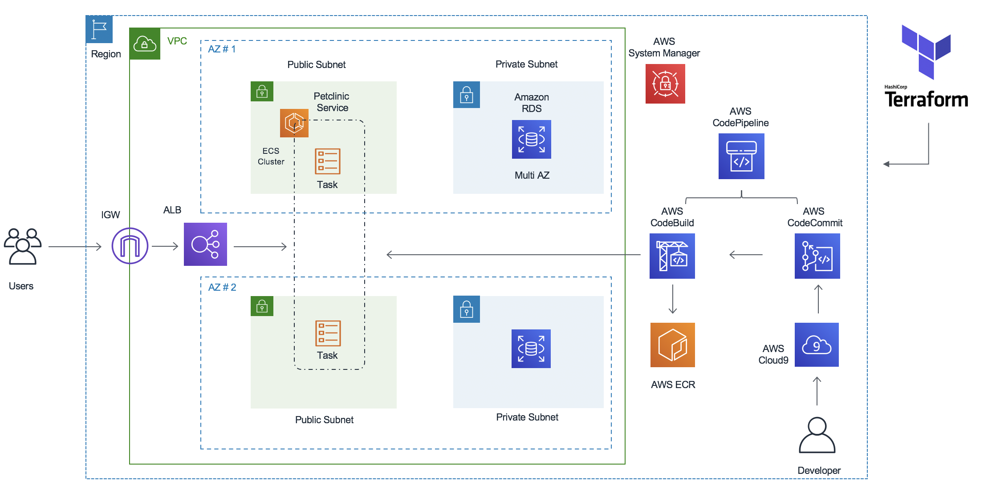
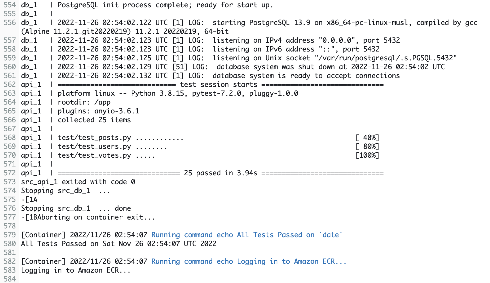

# API DevOps - ECS(Fargate) - CI/CD - Terraform
We develop a Python API using FastAPI with Postgres as a backend, create a test module to test the desired functionalities of this API during development, containerize all components and deploy it on AWS ECS using Fargate. We use `Terraform` as the IaC to provision all resources for building a CI/CD pipeline starting Github, AWS Codebuild, AWS CodePipeline to Amazon ECS.

### Build FastAPI App
I followed [this tutorial ](https://www.youtube.com/watch?v=0sOvCWFmrtA&t=56212s)to build the app and its test module.
FastAPI is a quick tool for building an API using Python which also provides documentation automatically. Directory _fastapi/app/_ contains a simple CRUD app with voting previleges for users and login requirement that checks credentials via JWT (rather than using _sessions_). After registration (create users), a temporary Bearer token is created for the user at _login_ with an expiray time encoded into it (_app/oauth2.py_) and will be sent to the user (_app/routers/auth.py_). This token will be used to authorize the users so it must be sent back to the API with every requests (in the header) that user sends later on. To ensure this requirement, every operation _depends__ on oauth2 in all modules in _app/routers/_. Postgres_ is used as the relational database backend. Its UI _pgAdmin_ makes it easy to check the progress easier. _SQLAlchemy_ is used as ORM (Object Relational Mapper) for Python to communicate table structures (specified in _app/models.py_) and queries (_app/routers/_) with the database in an object-oriented fashion. It connects to database server with a url that has the form of 

`
    postgresql://{database_username}:{database_password}@{database_hostname}:{database_port}/{database_name}
`

_Alembic_ is used as a tool to control migrations. It works as version control for our database table schemas for example. In order to customize the structure of the requests and responses for each operation, we use _config.py_.  

### Automatic Testing 
For automatic testing, a _test_ package (fastapi/test/) is created that will be operated using `pytest`. There is a test designed for every functionality of the app (posts, users, votes). A separated environment (database and connection) is needed for testing to aviod disturbing the production backend, of course. Also for some testing tasks, the databse should be flushed, for example when we want to test functionalities related user authority or multiple users etc, (See _conftest.py_ for more details). A containerized version of the app for every stage including test stage can be created using docker compose yaml files (_docker-compose-test.yml_) on our local machine. Using docker makes things easy and fast! We can have all 3 environment running on our local machine (a Macbook Air) at the same time. When you are building images on Arm64 and to run that image on 86x, remember to use option `--platform=linux/amd64`. For example

`docker build -t fastapi . --platform=linux/amd64`  

### Github Actions CI/CD
Given the app is in production on a machine already, one can use github actions yaml file in `.github` to create a CI/CD pipleline consisitng of build, test and deploying the app. Every push to the main branch, triggers the CI/CD pipeline. Environment variables ahouls be stores as `secrets` under settings of the github repo so it is available for github runners. At the build stage, a postgres image in pulled from Dockerhub along with our source code form our github repo to run the tests using pytest. If all tests passed, a docker image is built from Dockerfile and push to our repo. If not, pipleline doesnt go to deploy stage. The deploy stage requires running remote command to the production machine to pull the new changes from git repo and restart the app on the production machine. If you dont want to use your cloud credentials in anyways (not even github secrets) as the best security practice recommented, SSM can be used for Amazon EC2, for example. In the case of less strict security measures, github marketplace can also be used. In general, using Github Actions was a good exercise for me but perhaps not the best solution for a production environment in the cloud.

### Amazon ECS for Production
In reality, production environments and their maintenance are more complex than dealing with a single running compute machine. This is one of the good reasons why cloud is useful to take away the burden of IT tasks from users shoulder so they are focused on building apps rather than worring about infrastrutures. 

_Amazon Elastic Container Service + Fargate_ helps a lot with orchestrating containers, high availability, scalabilty and security of production environments. So I paired Amazon ECS with Amazon RDS (Relational Database Service) to host the app inside a VPC and equipped it with a _load balancer_. 

Amazon Developer tools provides ready to use tools to quickly build CI/CD piplelines and deploy to the production. The whole process can be done in a fully automated and repeatable manner when an infrastructure-as-code (IaC) tool such as Terraform is used for building cloud infstructures. 

## AWS CodePipeline CI/CD Architecture
The architecture of the CI/CD pipeline here is a copy of the one in this repo: [aws-samples / aws-ecs-cicd-terraform](https://github.com/aws-samples/aws-ecs-cicd-terraform) except that I used my local machine instead of Cloud9 and Github instead of AWS CodeCommit:



The scope of this pattern is to provide a guide and ready to use terraform configurations to setup validation pipelines with end-to-end tests based on AWS CodePipeline, AWS CodeBuild, Github or AWS CodeCommit and Terraform. 

The created pipeline uses the best practices for infrastructure validation and has the below stages:

- validate - This stage focuses on terraform IaC validation tools and commands such as terraform validate, terraform format, tfsec, tflint and checkov
- plan - This stage creates an execution plan, which lets you preview the changes that Terraform plans to make to your infrastructure.
- apply - This stage uses the plan created above to provision the infrastructure in the test account.
- destroy - This stage destroys the infrastructure created in the above stage.
Running these four stages ensures the integrity of the terraform configurations.

## Build the infrastructure and CI/CD pipeline

#### Step 1: Configure AWS env, install Terraform
An AWS user account with sufficient permissions (maybe administrator) and programmatic access is needed to start. Then install AWS CLI and Terraform on your machine. Configure aws environment in VSCode by providing user credentials for the user account being used for this project and activate a profile. You might want to install a Terraform extension for VSCode for syntax highlighting. Here is an [example instruction](https://www.youtube.com/watch?v=iRaai1IBlB0) for these steps in addition to a simple project using Terraform.

#### Step 2: Set up GitHub connection credential, update the variables in `terraform/terraform.tfvars` based on your requirement. Make sure you are updating the variables project_name, environment, source_repo_name, source_repo_branch, create_new_repo, stage_input and build_projects.

- In order for AWS CodePipline to have access to Github repo, go to CodePipeline > settings > connections > create connection, choose GitHub and a name and authorize CodePipeline to have access to your repo. After that, a _codestar_ connection Arn is created that will be used in `terraform/terraform.tfvars`. If you want to use DockerHub for your container repo, you can use AWS _Secrets Manager_ to store the credential that is used when loging in to your repo in CodeBuild, `buildspec.yml`. Otherwise, AWS ECR is used instead.

- Update environment variables needed for the containerized app such as `SECRET_KEY` for JWT token encoding ect. Update remote backend configuration as required. We are using AWS RDS with a postgres instance to serve as a database. Configure variables such as names and database ports (5432 for postgres, 3306 for MySql) etc. Also aws_region!

- Set up SSM parameter for DB passwd in production 
```shell
aws ssm put-parameter --name /database/password  --value mysqlpassword --type SecureString
```

#### Step 3: Initialize the terraform directory. 
Initialise Terraform and format the file so they look tidy. 

```shell
cd terraform
terraform init
terraform fmt
terraform plan
```
Terraform will display an action plan.
Build the infrastructure and pipeline using terraform:

```shell
terraform apply -auto-approve
```
Wait for Terraform to complete the build before proceeding. It will take few minutes to complete “terraform apply”. 

### Check the stack built

Once the build is complete, you can explore your environment using the AWS console:

* View the RDS database using the Amazon RDS console.
* View the ALB using the Amazon EC2 console.
* View the ECS cluster using the Amazon ECS console.
* View the ECR repo using the Amazon ECR console.
* View the CodeBuild project using the AWS CodeBuild console.
* View the pipeline using the AWS CodePipeline console.

Now if you go to to AWS CodePipeline, you migth see the pipeline failed at the first stage connecting to GitHub. This is because pipleline fired for the first time before permissions are yet established. You can click `Retry` to restart the pipeline or trigger the pipleline by a push into GitHub repo!

# Trigger CI/CD Pipeline
To trigger the pipeline, push the master branch to the remote as follows:
```shell
git push -u origin main
```
The pipeline will pull the code from GitHub, builds a an image to run testing the app. This is done using `docker-compse-test.yml`. This docker compose is consists of two services: _db_ (postgres:13-alpine) and _api_. built from `Dockerfile`. Once all tests passed, container successfully exits because of the option
 `--abort-on-container-exit --exit-code-from api`
in docker run command. This option causes the composite container stops when one service exits and also returns the exit code. More details can be found in the log:

If any test is not passed, container exits unseccessfully, the build stage fails and the pipeline state is failed. After prebuild stage is compeleted, the build and post-build stage continue to build an image of the new version of the app and push it to ECR. This is the __build stage__ in our pipeline. 

We could have place a manual approval stage before deploying to production. Finally, the app is deployed to ECS cluster. A new revision of services is created and deployed automatically by Fargate according to new image built in the previous stage. New tasks starts running and after the system reaches its stability, the old versions (already running and serving on hosts) are removed. This will take a few minutes. 

## Test the application
From the output of the Terraform build, note the Terraform output alb_address. 

```shell
cd ../terraform
echo $(terraform output alb_address)
```
Or you can use AWS console to find load balancer under EC2 console and find the endpoint provided by the loader balancer from there. The new version of the app should be up and runnig at that address in our browser.

## Destroy Infstructure
Destroy all resources is as easy as running the following command:
```shell
cd ../terraform
terraform destroy
```